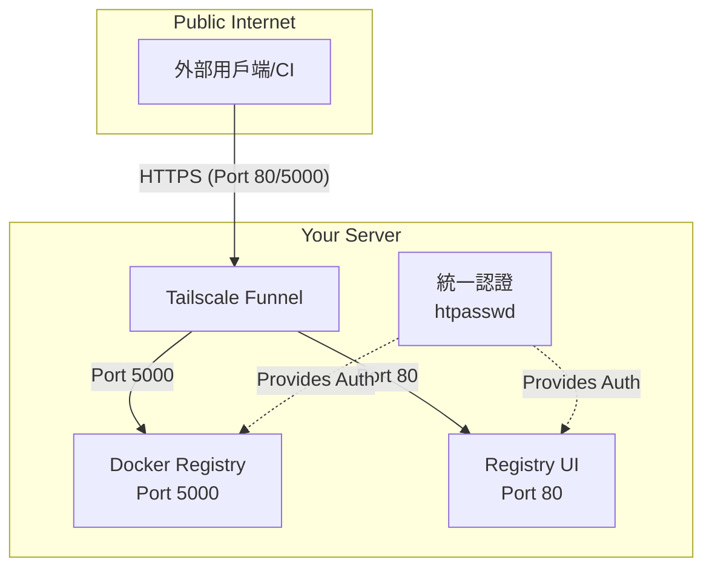

# OneClickRegistry 私有映像倉庫部署說明

本專案提供「Registry + Registry UI」安裝方案，使用 **Tailscale Funnel** 實現安全外網存取。適合需要自架私有 Docker Registry 並使用帳號密碼驗證的開發者。

## 自動化解決的麻煩事項

本專案透過一鍵部署腳本，自動化解決了以下複雜的設定問題：

- **安全隧道設定**：透過整合 Tailscale Funnel，無需任何 DNS 或 SSL 憑證設定，即可將服務安全地發佈到網際網路。
- **自動產生內網憑證**：自動生成自簽 SSL 憑證，確保內部服務間通訊安全。
- **簡化密碼設定**：只需輸入一次 htpasswd 格式的密碼，自動套用到所有服務。
- **CORS 問題處理**：自動設定跨域請求處理，避免 Registry UI 操作失敗。
- **統一認證機制**：一套帳號密碼管理所有服務，無需分別設定。
- **自動目錄建立**：自動建立所需的目錄結構和設定檔案。
- **一鍵啟動**：所有服務透過 Docker Compose 自動啟動，無需手動管理多個服務。

主要特色與條件如下：

1. 單一域名多埠口架構：使用同一域名但不同的埠口存取不同服務（UI和Registry）。
2. Registry 需可供外部拉取映像，強制走 HTTPS。
3. Registry 強制啟用帳號密碼驗證。
4. Registry UI 已處理跨域請求（CORS）問題，避免前端操作失敗。
5. **統一認證機制**：同一組帳號密碼用於 Registry 登入和 UI 存取。

---

## 必要的 Tailscale 後台設定

在使用本系統前，您需要在 Tailscale 後台進行以下設定：

1. **啟用 MagicDNS 和 HTTPS 憑證**：
   - 前往 [Tailscale Admin Console -> DNS](https://login.tailscale.com/admin/dns)
   - 確保 MagicDNS 已開啟
   - 確保「Enable HTTPS Certificates」已勾選

2. **設定 Funnel 權限**：
   - 前往 [Tailscale Admin Console -> Access Controls](https://login.tailscale.com/admin/acls)
   - 確保您的 ACL 配置包含以下內容：
   ```json
   "nodeAttrs": [
     {
       "target": ["autogroup:member", "tag:container"],
       "attr":   ["funnel"],
     },
   ],
   ```

如果沒有進行這些設定，Funnel 將無法正常工作！

---

## 架構關係圖



## 📁 專案結構

```
.
├── docker-compose.yml         # Docker 編排主設定
├── .env                       # 環境變數檔（由腳本自動生成）
├── registry/
│   ├── auth/                  # htpasswd 認證檔案存放處
│   ├── certs/                 # 內部通訊用自簽憑證
│   └── data/                  # Docker 映像檔儲存
├── tailscale/
│   └── config/
│       └── funnel.json        # Tailscale Funnel 設定檔（由腳本自動生成）
├── .gitignore
├── start.sh                   # 一鍵啟動腳本
└── README.md                  # 本文件
```

---

## 🚀 快速開始

### 1. 準備認證資訊

在啟動腳本前，請先準備好以下兩項資訊：

#### a. htpasswd 認證資訊
此認證資訊將用於 Registry 登入和 UI 存取的統一認證。
格式範例：`username:$apr1$le1k9qfm$TjAF6rksD1nRw0QhJkW7o.`

您可以透過 **Docker** 產生（推薦）：
```bash
docker run --rm --entrypoint htpasswd httpd:2 -Bbn registryuser yourpassword
```

#### b. Tailscale OAuth Key (必要)
本系統需要使用 Tailscale Funnel 進行外網存取，因此必須提供 OAuth Key。
1. 前往 [Tailscale Admin Console -> Settings -> OAuth Clients](https://login.tailscale.com/admin/settings/oauth)
2. 點擊 "Generate OAuth client"
3. 設定 Scopes：必須勾選 "Auth Keys: Write"
4. 設定 Tags：必須包含 "tag:container"
5. 複製產生的 OAuth Client Secret (格式如 `tskey-oauth-client-xxxx`)

這個 OAuth Key 將用於自動建立和管理 Tailscale 的臨時設備。

### 2. 下載與啟動互動式設定

```bash
wget https://github.com/markx2008/OneClickRegistry/releases/latest/download/OneClickRegistry.tar.gz
tar -xzvf OneClickRegistry.tar.gz
cd OneClickRegistry
```

執行 `start.sh` 時，腳本會引導您完成所有設定。

### 3. 啟動所有服務

請先賦予啟動腳本執行權限，然後執行：
```bash
chmod +x start.sh
./start.sh
```
腳本會要求輸入您準備好的認證資訊，然後自動建立所需目錄、設定檔並啟動所有服務。

---

### 4. 存取您的服務

腳本執行成功後，會顯示您的服務存取網址。

#### 透過 Tailscale Funnel 存取

服務將可透過安全的 HTTPS 網址從任何地方存取：
-   **Registry UI**: `https://registry.your-tailnet.ts.net:80`
-   **Docker Registry**: `https://registry.your-tailnet.ts.net:5000`
-   **Docker Login**: `docker login registry.your-tailnet.ts.net:5000`

您可以在 [Tailscale Admin Console](https://login.tailscale.com/admin/machines) 查看您的設備與確切的網域名稱。

---

### 5. 驗證服務

-   **UI 入口**：在瀏覽器開啟您的 Registry UI 網址（Port 80），使用您設定的 htpasswd 認證登入。
-   **推送/拉取映像檔**：
    ```bash
    # 使用您的 Registry 域名和端口
    docker login registry.your-tailnet.ts.net:5000
    ```
    輸入您在 htpasswd 設定的帳號密碼即可。

---

## ⚠️ 注意事項

- `registry/data/` 與 `registry/auth/` 目錄已被 `.gitignore` 排除，請勿將敏感資料提交至版本控制。
- 詳細設定與參數請參考各檔案內的註解說明。
- **一鍵部署**：只需一支腳本即可完成所有設定。
- **彈性自訂**：所有設定皆集中於 `.env` 檔案，方便管理。
- **CORS 處理**：已解決 UI 與 Registry API 間的跨域問題。
- **統一認證**：使用同一組 htpasswd 認證資訊管理所有服務的存取權限。
- **單一域名多埠口**：使用同一個域名，但透過不同的埠口存取不同服務，簡化 DNS 設定。

---

## 先決條件

1. **已安裝 Docker 與 Docker Compose 的伺服器/NAS**
2. **Tailscale 帳號**（必要）
3. **Tailscale 後台設定**（請見上方「必要的 Tailscale 後台設定」章節）

---

## 操作步驟

1. **準備 htpasswd 與 Tailscale OAuth Key**
   請在執行腳本前，先準備好 htpasswd 格式的認證資訊與 Tailscale OAuth Key（見上方說明）。

   **若已經有在執行中的服務，想要更新 htpasswd，可以直接編輯 ./registry/auth/htpasswd 檔案，然後執行下列指令重啟服務，讓新密碼生效：**
   ```bash
   docker-compose restart
   ```

2. **執行啟動腳本**
   此腳本會建立必要檔案並啟動所有服務。
   ```bash
   chmod +x start.sh
   ./start.sh
   ```

3. **從外網存取**
   - UI 介面：https://registry.your-tailnet.ts.net:80
   - Registry：https://registry.your-tailnet.ts.net:5000

4. **修改 funnel.json 後的注意事項**
   如果您手動修改了 tailscale/config/funnel.json 檔案，需要重啟 tailscale 容器才能套用新設定：
   ```bash
   docker-compose restart tailscale
   ```