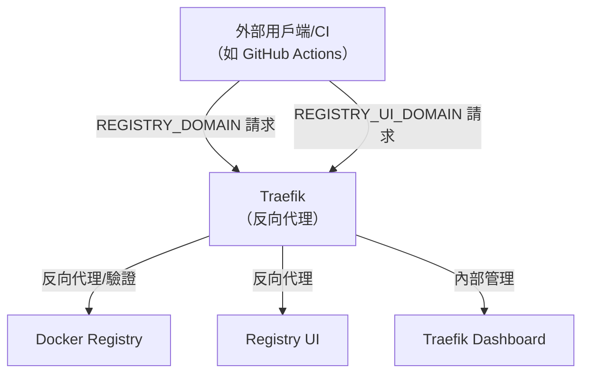

# OneClickRegistry 私有映像倉庫部署說明

本專案提供「Traefik + Registry + Registry UI」安裝方案，適合需要自架私有 Docker Registry 並使用帳號密碼驗證Registry，提供給部屬服務拉取鏡像。
主要特色與條件如下：

1. Registry 需可供外部拉取映像，必須經由反向代理（如 Traefik）並強制走 443（HTTPS），否則 Docker 會報錯。
2. Registry 強制啟用帳號密碼驗證。
3. Registry UI 已處理跨域請求（CORS）問題，避免前端操作失敗。


---

## 架構關係圖


```mermaid
graph TD
    A[外部用戶端/CI<br>（如 GitHub Actions）]
    B[Traefik<br>（反向代理）]
    C[Docker Registry]
    D[Registry UI]
    E[Traefik Dashboard]

    A -- REGISTRY_DOMAIN 請求 --> B
    A -- REGISTRY_UI_DOMAIN 請求 --> B
    B -- 反向代理/驗證 --> C
    B -- 反向代理 --> D
    B -- 內部管理 --> E
```
## 📁 專案結構

```
.
├── docker-compose.yml         # Docker 編排主設定
├── .env.example               # 環境變數範本
├── traefik/
│   └── middlewares.yml        # Traefik 中間件（認證設定）
├── registry/
│   ├── auth/                  # htpasswd 認證檔案存放處
│   └── data/                  # Docker 映像檔儲存（已被 .gitignore 排除）
├── .gitignore                 # 忽略敏感與執行時檔案
├── start.sh                   # 一鍵啟動腳本
└── README.md                  # 本文件（說明與操作指南）
```

---

## 🚀 快速開始

### 1. 準備 htpasswd 認證資訊

在啟動腳本前，請先準備好 htpasswd 格式的認證資訊。腳本執行過程中會要求您輸入此資訊。

格式範例：`username:$apr1$le1k9qfm$TjAF6rksD1nRw0QhJkW7o.`

您可以透過以下方式產生：

- **用 Docker 產生 bcrypt 格式（推薦）**：
  ```bash
  docker run --rm --entrypoint htpasswd httpd:2 -Bbn registryuser yourpassword
  ```

- **用 Python 產生 bcrypt 格式**：
  ```python
  import bcrypt
  user = "registryuser"
  password = b"yourpassword"
  hashed = bcrypt.hashpw(password, bcrypt.gensalt())
  print(f"{user}:{hashed.decode()}")
  ```

- **或使用線上工具**：https://www.htaccesstools.com/htpasswd-generator/ （選 bcrypt）

### 2. 下載與啟動互動式設定

```bash
wget https://github.com/markx2008/OneClickRegistry/releases/latest/download/OneClickRegistry.tar.gz
tar -xzvf OneClickRegistry.tar.gz
cd OneClickRegistry
```

執行 `start.sh` 時，系統會以對話方式詢問你所有必要參數（如 Registry 網域、UI 網域、帳號等），以及 Registry 的 htpasswd 認證資訊。

### 3. 啟動所有服務

請先賦予啟動腳本執行權限，然後執行：

```bash
chmod +x start.sh
./start.sh
```
此腳本會自動建立所需目錄、設定認證資訊、啟動 Traefik、Registry 及 Registry UI。

---

### 4. 設定外部存取（選用）

> **注意**：此步驟為**非必要**，僅適用於需要從外部網路存取 Registry 的情況。如果您的 Registry 僅供內部網路使用，可跳過此步驟。

#### 方案一：使用 Cloudflare Tunnel（推薦）

Cloudflare Tunnel 可以安全地將您的內部服務暴露到公網，無需開放防火牆埠或設定複雜的反向代理。

1. **安裝與設定步驟**：
   - 登入 [Cloudflare Zero Trust 儀表板](https://one.dash.cloudflare.com/)
   - 前往 `Access` → `Tunnels` → 點擊「建立新 Tunnel」
   - 為 Tunnel 命名（如「Registry Tunnel」）並點擊「下一步」
   - 依照指示在您的伺服器上安裝 `cloudflared`
   - 安裝完成後，設定公開主機名稱：
     - 新增主機名稱 1：`registry.yourdomain.com` → 指向 `localhost:8880`
     - 新增主機名稱 2：`ui.yourdomain.com` → 指向 `localhost:8880`
   - 點擊「儲存」完成設定

2. **驗證 Tunnel 連線**：
   - 執行 `cloudflared tunnel info <tunnel-id>` 確認 Tunnel 狀態
   - 在瀏覽器訪問 `https://ui.yourdomain.com` 檢查 UI 是否正常顯示

#### 方案二：手動設定反向代理

如果您已有其他反向代理（如 Nginx、Apache），可以手動設定：

1. 將以下域名指向您的 NAS/伺服器 IP：
   - `registry.yourdomain.com` → 指向 `http://<your-nas-ip>:8880`
   - `ui.yourdomain.com` → 指向 `http://<your-nas-ip>:8880`
   - `traefik.yourdomain.com` → 指向 `http://<your-nas-ip>:8881`（儀表板）

2. 確保您的反向代理已正確設定 SSL 憑證，因為 Docker 要求 Registry 必須使用 HTTPS

#### 方案三：僅內部網路使用

如果您只在內部網路使用 Registry：

1. 在內部 DNS 伺服器中設定以下記錄：
   - `registry.yourdomain.local` → 指向 `<your-nas-ip>`
   - `ui.yourdomain.local` → 指向 `<your-nas-ip>`

2. 或在本地電腦的 hosts 檔案中加入：
   ```
   <your-nas-ip> registry.yourdomain.local ui.yourdomain.local
   ```

3. 在 Docker 設定中加入信任設定（因為使用自簽憑證或 HTTP）：
   ```json
   // /etc/docker/daemon.json
   {
     "insecure-registries": ["registry.yourdomain.local:8880"]
   }
   ```

---

### 5. 驗證服務

- UI 入口：`https://ui.your-domain.com`，可用瀏覽器開啟 Registry UI。
- 推送/拉取映像檔：
  ```bash
  docker login registry.your-domain.com
  ```
  輸入你在 htpasswd 設定的帳號密碼即可。

---

### 6. 常見問題

- 若 Docker login 報錯，請確認 Registry 是否經由 HTTPS 反向代理，且 port 設定正確。
- 若 UI 操作出現 CORS 問題，請確認 `.env` 內 CORS 相關設定與 Traefik 設定檔。
- 內部測試可直接用 IP:port 存取，外部建議透過 Cloudflare Tunnel。

---

## ⚠️ 注意事項

- `registry/data/` 與 `registry/auth/` 目錄已被 `.gitignore` 排除，請勿將敏感資料提交至版本控制。
- 詳細設定與參數請參考各檔案內的註解說明。
- **一鍵部署**：只需一支腳本即可完成所有設定。
- **彈性自訂**：所有設定皆集中於 `.env` 檔案，方便管理。
- **CORS 處理**：已解決 UI 與 Registry API 間的跨域問題。

---

## 先決條件

1. **一個網域名稱**（如：`your-domain.com`）
2. **Cloudflare 帳號**（用於免費 Tunnel 服務）
3. **已安裝 Docker 與 Docker Compose 的伺服器/NAS**

---

## 操作步驟

1. **準備 htpasswd 認證資訊**
    請在執行腳本前，先準備好 htpasswd 格式的認證資訊（見上方說明）。
    
    **若已經有在執行中的服務，想要更新 htpasswd，可以直接編輯 ./registry/auth/htpasswd 檔案，然後執行下列指令重啟 Registry 服務，讓新密碼生效：**
    ```bash
    docker-compose restart registry
    ```

2. **執行啟動腳本**
    此腳本會建立必要檔案並啟動所有服務。
    ```bash
    chmod +x start.sh
    ./start.sh
    ```

3. **設定外部存取**
    根據您的需求，選擇上方「設定外部存取」章節中的適合方案進行設定。